Introdución
===========

El sistema de Difusión Automática de Vigilancia Dependiente[1] es una
tecnología de vigilancia para aeronáutica en base a los datos del
sistema de navegación de la aeronave (dependiente) que se emite de forma
automática cada segundo.

A diferencia del Radar tradicional, el cual funciona rebotando ondas de
radio emitidas desde antenas terrestres en objetivos aéreos e
interpretando estas señales reflejadas; ADS-B usa el Sistema Global de
Navegación por Satélite [2] para obtener su ubicación y lo combina con
información de la aeronave (como ser velocidad, dirección, altitud,
número de vuelo, etc) para luego transmitirlo de forma automática.

El uso de este sistema está regulado por la Organización de Aviación
Civil Internacional OACI [3], el cual es un organismo especializado de
las Naciones Unidas, creado por los Estados en 1944 para ejercer la
administración y velar por la aplicación del Convenio sobre Aviación
Civil Internacional.

Objetivo
========

Desplegar un sistema de adquisición de datos ADS-B para determinar su
factibilidad en la identificación de Aeronaves y Rutas
civiles/comerciales

Antecedentes
============

El convenio sobre Aviación Civil Internacional firmado en Chicago el 7
de diciembre de 1944 (actualmente se encuentra en su novena versión del
2006) establece la soberanía del espacio aéreo de cada estado, pero al
mismo tiempo permite el sobrevuelo de aeronaves civiles en otro estado,
siempre que cumplanlas regulaciones, además de que este convenio crea la
Organización de Aviación Civil Intenracional (OACI o por sus siglas en
ingles ICAO) para mantener el convenio, mediar entre Estados y mantener
un desarrollo de aeronaves y aeropuertos para fines pacíficos. Es en ese
marco que plantean en el Anexo 10 al convenio, las Telecomunicaciones
Aeronáuticas, donde desarrolló un estándar internacional, para sistemas
de ayuda, procedimientos y sistemas de comunicación, y sistemas de radar
de vigilancia y systemas de evación de colisión, junto al espectro de
radiofrecuencias que se utilizarán en estos sistemas.

Por otra parte en Bolivia, la ley 412, de 16 de octubre de 1968
(originalmente D.S. 08019) crea la Administración de Aeropuertos y
Servicios Auxiliares a la Navegación Aérea (AASANA) para la
planificación, dirección y administración de aeropuertos, y la
organización del espacio aéreo y el control de su tránsito acorde al
Convenio sobre Aviación Civil Internacional.

En la Ley 2902, de 29 de octubre de 2004, de la Aeronáutica Civil de
Bolivia, se define la necesidad de una autoridad Aeronáutica, para
colaborar con el control y registro de las aeronaves, y es en el Decreto
Supremo 28478 de 2 de diciembre de 2005, que se crea la dirección
General de Aeronática Civil (DGAC) para planficar, reglamentar y
fiscalizar las actividades de la aviación civil.

La Ley 521, de 22 de abril de 2014 , de Seguridad y Defensa del Espacio
Aéreo, establece entre otros puntos, la soberanía del espacio aéreo, e
instancia el Comando de Seguridad y Defensa del Espacio Aéreo, y su
consejo de coordinación técnica- Operativa, que se integra por la Fuerza
Aérea Boliviana FAB, la Dirección General de Seguridad Nacional
Aeropuertaria- DIGESNA Administración de Aeropuertos y Servicios
Auxiliares a la Navegación Aérea AASANA,y la Dirección General de
Aeronáutica civil DGAC.

Es apartir de esta ley, que mediante el Decreto supremo 2842, de 13 de
julio de 2016, que se financia el proyecto “Sistema Integrado de Defensa
Aérea y Control de Tránsito Aéreo – SIDACTA” el cual se divide en dos
subsistemas: el Sistema de Defensa Aérea Nacional (SISDAN), que consta
de 7 radares primarios, y un Centro de Información y Control de
operaciones; y el Sistema de Vigilancia y Control del Espacio Aéreo
(SIVICEA) que consiste en 6 radares secundarios RSM-970S (Modo S), 4
centros de Control de Aproximación y un Centro de Control Aéreo. El
SIDACTA continúa en fase de instalación/provisión y se espera esté
entregado hasta mayo del 2019.

Justificación
=============

Si bien existen servicios externos para la ubicación y rastreo de vuelos
comerciales [4], éstos son controlados y limitados tanto en información
como en consumo de datos, donde una empresa privada puede solicitar que
sus vuelos no sean públicos, asi como limitar el tiempo de los datos
visibles. Es interesante notar que varios de estos servicios se basan en
receptores ADS-B instalados por sus propios usuarios (a cambio de
mayores prestaciones, como flujo de datos, etc), y como dato curioso,
existen muy pocos receptores en Bolivia, por lo que se limita aún más la
cantidad de información disponible para nuestro territorio.

Marco teórico
=============

Algunos de los conceptos clave para entender esta tecnología y poder
aplicarla son: el origen del radar secundario en modo S y la radio
definida por software

Sistemas de Radar
-----------------

El sistema de radar primario (PSR Primary surveillance Radar) es un
sistema de detección que utiliza ondas de radio para determinar la
distancia, dirección y incluso velocidad de objetos voladores. Este tipo
de sistema trabaja totalmente independiente de las aeronaves, por lo que
es utilizado sobre todo para detectar y localizar objetivos no
cooperativos. Su mayor desventaja es la cantidad de potencia que se debe
irradiar para tener un rango aceptable. También debido a la débil señal
de retorno, es susceptible a interferencia por cambios de altura (que no
se puede determinar fácilmente con este tipo de sistema) o atenuación
por lluvia. Finalmente requiere de un proceso de identificación para
relacionar la información del radar con una aeronave en particular.

El sistema de radar secundario (SSR) surge de cubrir las deficiencias
del sistema de radar primario, especialmente el tema de identificación
de la aeronave y la altura de la misma. Surge del sistema militar de
identificación Amigo-Enemigo (IFF) y actualmente es utilizado en el
control de tráfico aéreo, el cual no solo detecta y mide la posición de
la aeronave (dirección y distancia), sino que también solicita
información adicional como ser su identidad y su altura, mediante un
equipo adicional en la aeronave denominado transpondedor (*Transponder*
- fusión de las palabras inglesas Transmitter-Responder)

Modos de Interrogación
----------------------

Originalmente la identificación se hace mediante una estación base que
emite pulsos de interrogación en 1030MHz, el transpondedor en la
aeronave, escucha esta señal de interrogación y transmite una respuesta
en 1090MHz conteniendo la información solicitada. Esta respuesta depende
del modo de interrogación, el cual corresponde el espaciamiento que
existe entre tres pulsos de 0.8 us denominados P1, P2 y P3. La
separación entre P1 y P2 es de 2us para supresión de lóbulo lateral (al
transmitir P2 por una antena omnidireccional a diferente potencia).
Existen varios modos de interrogación, tanto de uso militar (1 - 5) como
civil (A, C, S) éstas definidas por la OACI

#### Modo A

donde la separación entre P1 y P3 es de 8us. Este modo de interrogación
permite obtener el código de identificación en 12 pulsos que corresponde
a un número octal de 4 dígitos, que es asignado a la aeronave por el
controlador de tráfico. (este código se denomina también Squawk)

#### Modo C

donde la separación entre P1 y P3 es de 21us, Este modo de interrogación
genera un código de 11 pulsos que indica la altura barométrica de la
aeronave en incrementos de 100 pies.

#### Modo S

inicia con una separación entre pulsos de 3.5uS pero emitiendo P2 por la
misma antena (y por tanto, a la misma potencia, para evitar que lo vea
los transpondedores en modo A y C) y cambiando el pulso P3 por uno
denominado P6 el cual dura 1.25us y se utiliza para sincronizar la
modulación por fase, esta modulación por fase permite enviar más
información (entre 56 y 112 bits) en una ventana de 16 a 30us. Esta
trama de bits utiliza el principio de direccionamiento selectivo, donde
a cada aeronave se le asigna un dirección única de 24 bits por la OACI,
y se utiliza esta dirección para hacer una suma de verificación
(checksum) sobre el mensaje interrogado. Esto permite diferenciar a cada
aeronave para inquirir información específica de la misma, como ser
altitud [5] y el identificador de Modo A *(Squawk)*

Si bien el Modo S permite el intercambio de más información entre la
estación terrena y la aeronave, requiere que el origen de la solicitud
sea la estación terrena del Sistema de Radar Secundario.

Finalmente el 2009 la OACI define el modo de operación extended squitter
(modo de difusión periódica extendida) con más formatos de mensajes que
se emiten periódicamente y es lo que evolucionó en el sistema de
difusión automática de vigilancia dependiente **ADS-B**.

ADS-B a diferencia del sistema de radar secundario tradicional, no
requiere que una estación terrena solicite la información de la aeronave
(aunque debe permanecer compatible con las solicitudes de una estación
en Modo S), y tiene definido mensajes adicionales para la ubicación
(latitud, longitud), dirección, velocidad, e información del vuelo entre
otros.

Estructura del mensaje
----------------------

Un mensaje ADS-B es de 112 bits y consta de 5 partes.

<table>
<caption>Trama ADSB</caption>
<thead>
<tr class="header">
<th style="text-align: left;">DF 5</th>
<th style="text-align: left;">CA 3</th>
<th style="text-align: left;">ICAO 24</th>
<th style="text-align: left;">DATA 56</th>
<th style="text-align: left;">PI 24</th>
</tr>
</thead>
<tbody>
</tbody>
</table>

Fuente: *The 1090MHz Riddle* \[tab:adsb\_Frame\]

Donde cada campo corresponde a:

<table>
<caption>Estructura de los mensajes ADS-B</caption>
<thead>
<tr class="header">
<th style="text-align: left;">Pos</th>
<th style="text-align: left;">Abbr</th>
<th style="text-align: left;">n</th>
<th style="text-align: left;">Nombre</th>
</tr>
</thead>
<tbody>
<tr class="odd">
<td style="text-align: left;">1</td>
<td style="text-align: left;">DF</td>
<td style="text-align: left;">5</td>
<td style="text-align: left;">Enlace Descendente</td>
</tr>
<tr class="even">
<td style="text-align: left;">6</td>
<td style="text-align: left;">CA</td>
<td style="text-align: left;">3</td>
<td style="text-align: left;">Capacidades adicionales (modo S)</td>
</tr>
<tr class="odd">
<td style="text-align: left;">9</td>
<td style="text-align: left;">ICAO</td>
<td style="text-align: left;">24</td>
<td style="text-align: left;">Dirección OACI de la aeronave</td>
</tr>
<tr class="even">
<td style="text-align: left;">33</td>
<td style="text-align: left;">DATA</td>
<td style="text-align: left;">56</td>
<td style="text-align: left;">Datos</td>
</tr>
<tr class="odd">
<td style="text-align: left;">33</td>
<td style="text-align: left;">TC</td>
<td style="text-align: left;">4</td>
<td style="text-align: left;">[Código de Tipo]</td>
</tr>
<tr class="even">
<td style="text-align: left;">89</td>
<td style="text-align: left;">PI</td>
<td style="text-align: left;">24</td>
<td style="text-align: left;">Identificador de paridad/interrogador</td>
</tr>
</tbody>
</table>

Fuente: *The 1090MHz Riddle*

Para ADS-B el enlace descendente DF debe ser 17 (*Extendded Squitter*) o
18 (mensaje TIS-B[6]).

La dirección OACI de 24 bits se representa comúnmente en 6 dígitos
hexadecimales para identificar el transpondedor. Es asignado por la
misma OACI, y corresponde a direcciones especiales, reservadas y
regionales [7].

Los tipos mensajes ADS-B están codificados en los primeros 5 bits del
segmento de Datos. Existiendo mensajes de Identificación de la aeronave
(utilizado para transmitir información del vuelo actual), Posición y
altura GNSS, dirección, altura barométrica, estado de la aeronave, etc.

<table>
<caption>Tipo de mensajes ADS-B</caption>
<thead>
<tr class="header">
<th style="text-align: left;">Código</th>
<th style="text-align: left;">Contenido</th>
</tr>
</thead>
<tbody>
<tr class="odd">
<td style="text-align: left;">1 - 4</td>
<td style="text-align: left;">Identificación de Aeronave (Callsign)</td>
</tr>
<tr class="even">
<td style="text-align: left;">5 - 8</td>
<td style="text-align: left;">Posición Superficial</td>
</tr>
<tr class="odd">
<td style="text-align: left;">9 - 18</td>
<td style="text-align: left;">Posicion en Vuelo (con altura barométrica)</td>
</tr>
<tr class="even">
<td style="text-align: left;">19</td>
<td style="text-align: left;">Velocidades de Vuelo</td>
</tr>
<tr class="odd">
<td style="text-align: left;">20 - 22</td>
<td style="text-align: left;">Posicion en Vuelo (con altura GNSS)</td>
</tr>
<tr class="even">
<td style="text-align: left;">23 - 27</td>
<td style="text-align: left;">[Reservado]</td>
</tr>
<tr class="odd">
<td style="text-align: left;">28</td>
<td style="text-align: left;">Estado de la Aeronave</td>
</tr>
<tr class="even">
<td style="text-align: left;">29</td>
<td style="text-align: left;">Situación de objetivo</td>
</tr>
<tr class="odd">
<td style="text-align: left;">31</td>
<td style="text-align: left;">Estado de operación</td>
</tr>
</tbody>
</table>

Fuente: *The 1090MHz Riddle*

Esta información obtenida del sistema ADS-B suele presentarse en varios
formatos:

#### Formato AVR

Este formato expone la trama decodificada directamente en código
ASCII-Hexadecimal. para marcar el inicio de una trama, utiliza el
caracter ASCII asterisco 0x2A ”\*” y para finalizar la trama punto y
coma 0x3B ”;” seguido de retorno de línea.

    *8DE942015813545A4A6920A68D25;
    *5DE9406BA34331;
    *5DE94065A31770;
    *8DE94201F813200600497CFB2C98;
    *00E1913AD79C49;
    *00E1913928745B;

Por ejemplo el primer mensaje corresponde a DF=17 CA=5 (downlink de
ADS-B) correspondiente a la Aeronave E94201 (Cirrus SR20 Privado) envía
el paquete de datos que corresponde al tipo TC=11 (posición de vuelo)
ALT=135 (correspondiente a una altura de 7725 pies) y la latitud y
longitud en formato compacto[8]. Los siguientes dos paquetes son
respuesta de solicitudes en Modo-S (respuesta a llamada general o
*all-call reply* DF=11) conteniendo únicamente la dirección OACI (de las
aeronaves E9406B y E94065), el cuarto paquete es un mensaje ADS-B DF=17
CA=5 de la primera aeronave (E94201) donde envía un paquete de dato que
corresponde al tipo TC=31 (estado de operación) subtipo SC=0 (estado
aéreo) codigo de capacidades 0x1320 (TCAS operacional, con soporte de
entrada 1090ES, reporte ARV y TS sin UAT) codigo operacional = 0x0600
(recibiendo ATC y 1 sola antena) version ADS-B = 2, GVA=2 (precisión de
posición &lt; 150m). Los últimos dos mensajes, corresponden al sistema
anticolisión ACAS con DF=0 VS=0 (vigilancia aerea).

#### Formato ModeSbeast

. Es un formato más eficiente, difundido con uno de los mejores
receptores ADS-B el Mode-S Beast que utliza tecnología FPGA para la
decodificación de la trama ADS-B. En los mensajes que genera, se agrega
un identificador de tamaño de paquete, marca de tiempo de 6 bytes, y un
byte de intensidad de señal, estos dos ultimos datos, sirven para la
implementación de un servicio de multilateración.

    1a320a723f890cd18c 5fe94b6b96c317
    1a330a723fd4f7dfaa 8fe94b6b904d95247cc1e0fb6e72
    1a330a723fd50c20a8 8fe94b6b99045617a8200014d313
    1a330a72402b080fa2 8fe94b6b904d80f57060c03f01dd

Este es un ejemplo codificado en ASCII-Hex, ya que la trama se envia en
binario. Cada mensaje comienza con 0x1A \[SUB\] seguido del
identificador de tamaño (codigo ASCII de ”2” = 0x32 mensaje en modo S
pequeño de 56 bits) la marca de tiempo 0x0a723f890cd1 corresponde a
02:58:17.065946321 (hora del día con precisión de nanosegundos) y una
intensidad relativa de 140, el siguiente mensaje es un mensaje largo
(”3” = 0x33 mensaje en modo S de 112 bits) que ocurre en
02:58:17.070921695 (4.9ms después del anterior) con una intensidad
relativa de 170. Posteriormente los mensajes se decodifican con la trama
ya vista anteriormente, por ejemplo se ve un mensaje de identificación
de aeronave y 3 mensajes ADS-B para la aeronave E94B6B (Boeing 737NG de
Boliviana de Aviación).

#### Formato BaseStation SBS

, es un formato CSV (valores separados por coma) bastante universal,
difundido originalmente por uno de los softwares mas antiguos de ADS-B,
el BaseStation SBS-1 Virtual Radar, de la empresa Kinetic Avionic. Este
formato CSV, tiene 22 campos:

<table>
<caption>Formato BaseStation</caption>
<thead>
<tr class="header">
<th style="text-align: left;">Campo</th>
<th style="text-align: left;">Contenido</th>
</tr>
</thead>
<tbody>
<tr class="odd">
<td style="text-align: left;">1</td>
<td style="text-align: left;">Tipo de mensaje (MSG,STA,ID,AIR,SEL,CLK)</td>
</tr>
<tr class="even">
<td style="text-align: left;">2</td>
<td style="text-align: left;">Tipo de Transmisión de MSG</td>
</tr>
<tr class="odd">
<td style="text-align: left;">3</td>
<td style="text-align: left;">Sesión en BD</td>
</tr>
<tr class="even">
<td style="text-align: left;">4</td>
<td style="text-align: left;">Identificador en BD</td>
</tr>
<tr class="odd">
<td style="text-align: left;">5</td>
<td style="text-align: left;">Identificador hexadecimal (dirección OACI)</td>
</tr>
<tr class="even">
<td style="text-align: left;">6</td>
<td style="text-align: left;">Identificador vuelo en BD</td>
</tr>
<tr class="odd">
<td style="text-align: left;">7</td>
<td style="text-align: left;">Fecha del mensaje</td>
</tr>
<tr class="even">
<td style="text-align: left;">8</td>
<td style="text-align: left;">Hora del mensaje</td>
</tr>
<tr class="odd">
<td style="text-align: left;">9</td>
<td style="text-align: left;">Fecha del registro</td>
</tr>
<tr class="even">
<td style="text-align: left;">10</td>
<td style="text-align: left;">Hora del registro</td>
</tr>
<tr class="odd">
<td style="text-align: left;"></td>
<td style="text-align: left;"></td>
</tr>
<tr class="even">
<td style="text-align: left;">11</td>
<td style="text-align: left;">Identificador del Veulo (Callsign)</td>
</tr>
<tr class="odd">
<td style="text-align: left;">12</td>
<td style="text-align: left;">Altitud</td>
</tr>
<tr class="even">
<td style="text-align: left;">13</td>
<td style="text-align: left;">Velocidad en suelo</td>
</tr>
<tr class="odd">
<td style="text-align: left;">14</td>
<td style="text-align: left;">Dirección</td>
</tr>
<tr class="even">
<td style="text-align: left;">15</td>
<td style="text-align: left;">Latitud</td>
</tr>
<tr class="odd">
<td style="text-align: left;">16</td>
<td style="text-align: left;">Longitud</td>
</tr>
<tr class="even">
<td style="text-align: left;">17</td>
<td style="text-align: left;">Velocidad Vertical</td>
</tr>
<tr class="odd">
<td style="text-align: left;">18</td>
<td style="text-align: left;">Squawk (identificador en modo A)</td>
</tr>
<tr class="even">
<td style="text-align: left;">19</td>
<td style="text-align: left;">Alerta (bandera de cambio de Squawk)</td>
</tr>
<tr class="odd">
<td style="text-align: left;">20</td>
<td style="text-align: left;">Emergencia (bandera de codigo de Emergencia)</td>
</tr>
<tr class="even">
<td style="text-align: left;">21</td>
<td style="text-align: left;">SPI (bandera de activación de identificación)</td>
</tr>
<tr class="odd">
<td style="text-align: left;">22</td>
<td style="text-align: left;">Tierra (bandera de aterrizaje)</td>
</tr>
</tbody>
</table>

Fuente: *The 1090MHz Riddle*

los primeros 10 son constantes, es decir que cada mensaje tendrá todos
estos campos [9], los campos referentes a BD (base de datos) corresponde
a la respuesta enviada si el mensaje se obtuviera del registro
almacenado de un BaseStation original, normalmente tienen un valor
constante de 1 en los demás casos. El resto de la información se recibe
de la aeronave y se envia en un mensaje diferente cada vez, por ejemplo
un mensaje MSG,3 es para el reporte de la ubicación y se compone de los
campos 12, 15, 16 19, 20, 21 y 22; un mensaje MSG,4 es para el reporte
de velocidad y tendrá los campos 13,14,17.

    MSG,8,1,1,0C206B,1,2018/12/04,16:56:12.367, 2018/12/04, 16:56:12.398, ,,,,,,,,,,,0
    MSG,3,1,1,E94B6B,1,2018/12/04,16:56:12.393, 2018/12/04, 16:56:12.448, ,34825,,,-19.30987,-63.82013,,,,,,
    MSG,4,1,1,E94B6B,1,2018/12/04,16:56:12.393, 2018/12/04, 16:56:12.449, ,,466,21,,,-1664,,,,,
    MSG,5,1,1,0C206B,1,2018/12/04,16:56:12.417, 2018/12/04, 16:56:12.452, ,37000,,,,,,,0,,0,
    MSG,6,1,1,0C206B,1,2018/12/04,16:56:12.430, 2018/12/04, 16:56:12.454, ,,,,,,,0233,0,0,0,
    MSG,1,1,1,E07584,1,2018/12/04,16:56:12.446, 2018/12/04, 16:56:12.456, ARG1369 ,,,,,,,,,,,0

En esta pequeña muestra se puede ver distintos tipos de mensajes para 3
aeronaves cercanas, para la Aeronave 0C206B (Boeing737NG de Copa
Airlines) se tiene un mensaje 8 indicando que no se encuentra en el
suelo, un mensaje 5 indicando una altura de 37000 pies, un mensaje 6
indicando el codigo en modo A, Squawk, 0233; la Aeronave E94B6B (Boeing
737NG de Boliviana de Aviación) envia un mensaje 3 indicando su
ubicación (altura,latitud y longitud) y un mensaje 4 indicando su
dirección y velocidad. Casualmente se puede observar que una tercera
Aeronave E07584 (Boeing 737MAX de Aerolíneas Argentinas) reporta su
vuelo ARG-1369 (Santa Cruz - Buenos Aires)[10]

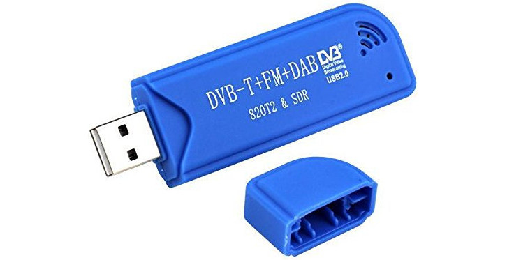 Fuente:
amazon.com \[fig:ccc0\]

Radio Definida por Software
---------------------------

La Radio Definida por Software (de su sigla en ingles SDR – Software
Defined Radio), surge de la necesidad de las telecomunicaciones de
adaptarse rápidamente a cambios o modificaciones de coste efectivo,
permitiendo la migración del análisis y procesamiento de señales
radioeléctricas de tecnologías inmutables de Hardware , hacia
procedimientos en Software, manteniendo las funcionalidades. Permitiendo
la existencia de equipamiento altamente flexible, con capacidad de
trabajar en múltiples bandas, modos, o incluso funciones. También
permite reprogramación por-el-aire [11] reduciendo el tiempo y costo
asociado con la operación y mantenimiento de equipos.

RTL2832
-------

El RTL2832 es un circuito integrado producido por Realtek Corporation
para demodular señales DVB-T y enviarlas por USB. Este chip tiene un
modo adicional no documentado que permite la recepción de radio FM, al
capturar muestras I/Q /footnoteseñales en cuadratura Amplitud – Fase con
su ADC de 8 bits y que se envian por USB para su posterior demodulación
y análisis. Tiene un ancho de banda teórico de 3.2MHz, pero se apoya en
otro circuito integrado como el E4000 para la sintonización donde es
capaz de recibir señales desde 64 a 1700MHz. Siendo una de las
alternativas más económicas de Radio definida por Software[12].
Alrededor de este y otros dispositivos existe un amplio desarrollo
incluyendo GNU Radio [13] y librtlsdr [14]

Metodología
===========

Para la recolección de Datos ADS-B se utilizó modulos SDR USB RTL2832U y
R820T, junto con antenas para 1090MHz, controladas por un pequeño
computador raspberry pi.

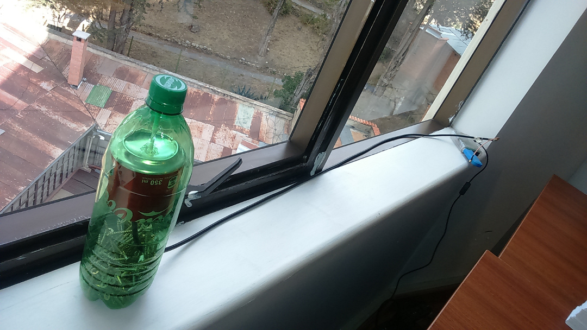
Fuente: Oficinas AGETIC \[fig:cocantena\]

Cocantena
---------

Para las pruebas iniciales se recurrió a un receptor DVB-T convencional
[15] cuya antena para radio y TV no era apropiado para la recepción de
señales ADS-B [16] por lo que se contruyó una antena omnidireccional
para 1090MHz, utilizando como plano de tierra una lata de aluminio.

Para ello se determinó la longitud de la antena a partir de la
frecuencia ADS-B y un cuarto de la longitud de onda,

$$\begin{gathered}
f = 1090 [MHz] \\
\lambda = \frac{c}{f} \\
\lambda = \frac{299792458 [\frac{m}{s}]}{1090 \cdot 10^{6}[\frac{1}{s}]} \\
\lambda = 0.275 [m] \\
\therefore \frac{\lambda}{4} = 0.0688 [m] = 68.8 [mm]
\label{eq:cuarta}\end{gathered}$$

La antena resultante, fue probada inicialmente en la ventana del 4to
piso del Edificio FNDR (Oficinas AGETIC)

Donde tuvo un desempeño pobre (distancia máxima de detección 30km)
debido, sobretodo, a la ubicación en medio de la ciudad y la obstrucción
de la línea de vista por parte de edificios aledaños.

Posteriormente se trasladó la antena a una ubicación más propicia en la
ciudad del alto, a 3km del Aeropuerto Internacional de El Alto,
obteniéndose un mejor desempeño (distancia máxima de detección 300km)

Dump1090
--------

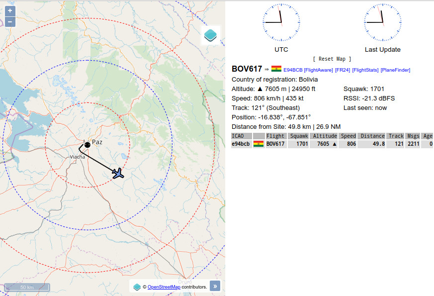
Fuente: Elaboración propia \[fig:dump\]

Para el procesamiento de la señal se optó por un desarrollo
existente[17], basado en un decodificador de Modo S diseñado en base a
librtlsdr. Esta aplicación permite levantar flujos de transmisión
continua con la información decodificada en formatos SBS, AVR y
modeSbeast, adicionalmente permite generar un sitio web local para el
despliegue de un mapa con las aeronaves detectadas.

Impulsados por los resultados obtenidos, se gestionó la instalación de
dos antenas adicionales en los aeropuertos de Viru Viru en Santa Cruz y
Jorge Wilstermann en Cochabamba. Para ello se optó por un receptor más
acorde al proyecto, utilizándose un receptor FlightAware y un filtro
para 1090MHz. Si bien el receptor está basado en el mismo RTL2832U tiene
una mejor ganancia y con el filtro permite eliminar interferencias de
frecuencias cercanas. La antena también está mejor diseñada para 1090MHz
por lo que el desempeño fue mucho mejor que el primer sistema, ya que en
Santa Cruz, se tuvo un alcance de hasta 500 km[18].

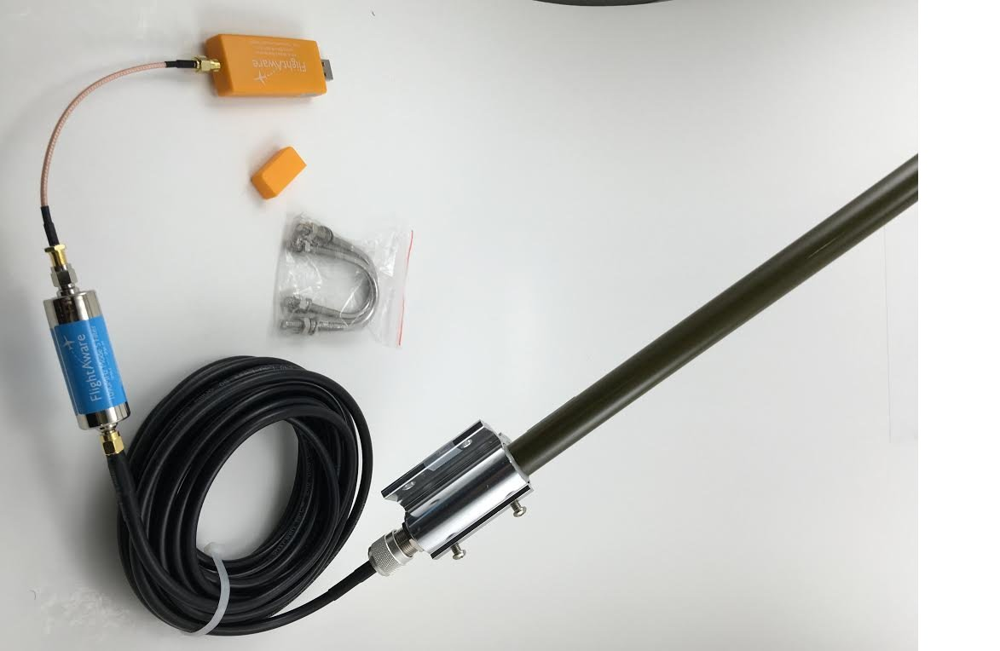
Fuente: amazon.com \[fig:flighaware\]

Todos estos receptores fueron enlazados mediante una Red Privada Virtual
para concentrar la información disponible.

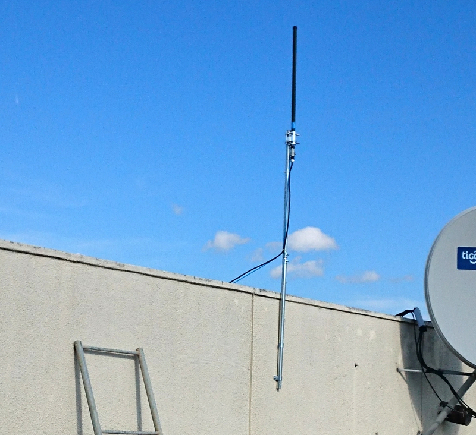
Fuente: Aeropuerto Viru Viru \[fig:antena\_vvi\]

VirtualRadar
------------

Para combinar la información de los receptores desplegados, se recurrió
a otro desarrollo existente, el Servidor Virtual Radar (VRS), una
aplicación de codigo abierto en dotNET con capacidad de combinar la
información de varios receptores que tengan flujos de red en formato
SBS, AVR o modeBeast (aprovechando la información extra de este último
formato). Al tener una base de datos propia para la información de las
aeronaves, es posible agregar o actualizar la información de registro,
modelo de avión y operador, apartir del identificador OACI.

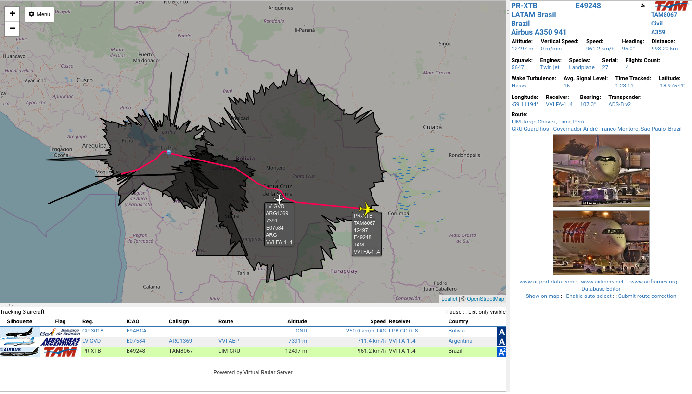 Fuente:
Elaboración Propia \[fig:vrs\]

Por ejemplo en la Figura
<a href="#fig:vrs" data-reference-type="ref" data-reference="fig:vrs">[fig:vrs]</a>
se puede ver la información de una aeronave en particular (y la
información obtenida de su base de datos local), junto con su ruta sobre
el mapa [19]. También se puede observar el área cubierta por cada
antena, dando bastante énfasis en el área cubierta por la antena de Viru
Viru.

Si bien el VRS permite generar reportes sobre los vuelos capturados,
tiene la pequeña deficiencia de no almacenar la información de la ruta
exacta de un vuelo ya almacenado, dando priorridad únicamente a las
posiciones de inicio y final de captura, por ejemplo, en la figura
<a href="#fig:reporte_vrs" data-reference-type="ref" data-reference="fig:reporte_vrs">[fig:reporte_vrs]</a>
se observa solo los puntos de principio y final de captura de datos de
un vuelo entre Lima y Sao Paulo, correspondiente a los límites del área
de cobertura de nuestras antenas.

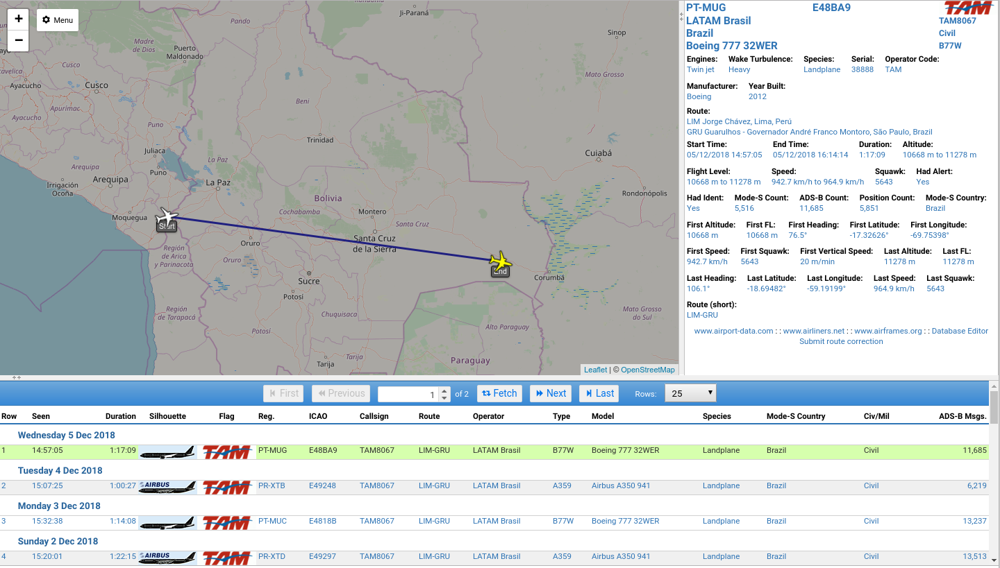
Fuente: Elaboración Propia \[fig:reporte\_vrs\]

Resultados
==========

Para el análisis de datos, se optó por alimentar la información de las
antenas a un red ADS-B con mayores prestaciones. obtándose por la red
OpenSkyNetwork, que ofrece herramientas estadísticas sobre el
rendimiento de los receptores.

El Alto
-------

El primer receptor instalado, tiene un buen desempeño[20] con un rango
entre 180 a 300 km cubriendo un área de 35.000 a 62.000 km2, con un
promedio de 550 mensajes procesados por dia (llegando a 44 mensajes por
segundo) y capturando hasta 50 aeronaves por día.

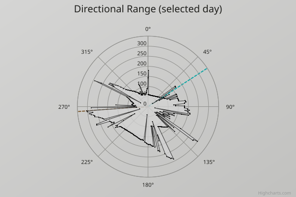
Fuente: OpenSky Network \[fig:lpb\_range\]

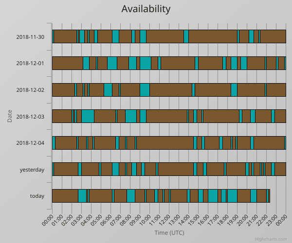
Fuente: OpenSky Network \[fig:lpb\_disp\]

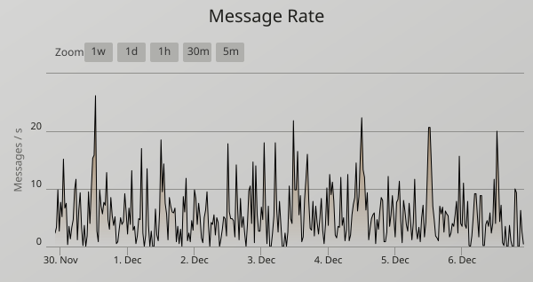
Fuente: OpenSky Network \[fig:lpb\_mes\]

Cochabamba
----------

Pese a ser un mejor receptor, esta antena tuvo un rendimiento medio[21],
recalcando de esta forma la importancia de la ubicación y la línea de
vista [22]. Tiene un rango entre 150 a 220km, cubriendo un área entre
25.000 a 40.000 km2, con 450.000 mensajes procesados por día (llegando a
32 mensajes por segundo) y capturando hasta 60 aeronaves por día.

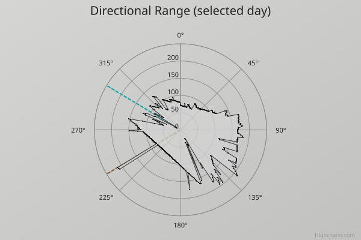
Fuente: OpenSky Network \[fig:cbb\_range\]

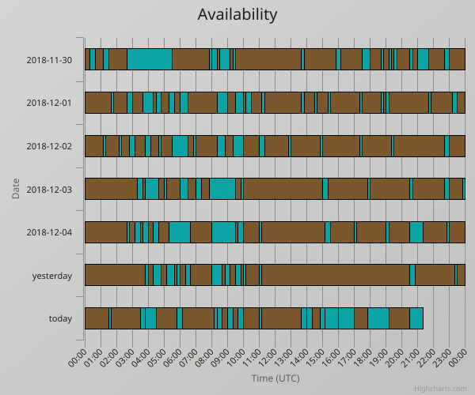
Fuente: OpenSky Network \[fig:cbb\_disp\]

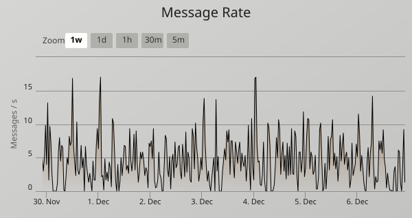
Fuente: OpenSky Network \[fig:cbb\_mes\]

Santa Cruz
----------

Esta fue la antena con el mejor rendimiento[23], con un promedio de
500km de rango direccional, cubriendo un área entre 200.000 a 350.000
km2, con 1.250.000 mensajes procesados por día (llegando a 32 mensajes
por segundo) y capturando hasta 100 aeronaves por día.

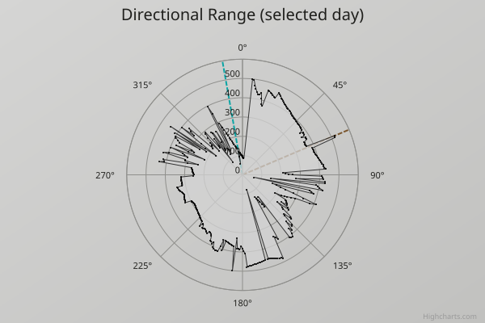
Fuente: OpenSky Network \[fig:vvi\_range\]

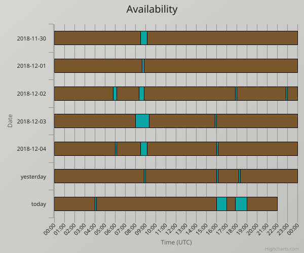
Fuente: OpenSky Network \[fig:vvi\_disp\]

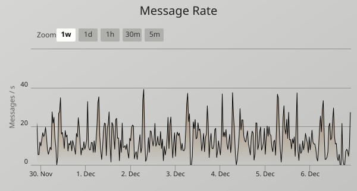
Fuente: OpenSky Network \[fig:vvi\_mes\]

Conclusiones
============

Tan sólo colocando 3 antenas receptoras ADS-B se ha logrado cubrir un
50% del territorio boliviano. Aunque se pudo evidenciar que la mayoría
de las aeronaves nacionales (principalmente de la línea amaszonas) solo
envían mensajes en Modo-S, impidiendo obtener su ubicación con el
arreglo actual. Para ello, se puede utilizar una técnica llamada
multilateración MLAT, que con 3 o más receptores ADS-B separados
espacialmente en 5km o más [24].

También se evidenció pequeñas falencias en los transpondedores de
algunas aeronaves nacionales, que tienen bastante interferencia
(posiblemente por falta de calibración en el mismo transpondendor) e
incluso varias aeronaves que tiene un arrastre de la señal GPS por falta
de calibración en sus antenas.

Si se implementara un sistema de recepción ADS-B que no entre en
conflicto con el SIVICEA (o incluso que pueda trabajar en conjunto para
corroborar - certificar la información) se debería ver de instalar más
antenas en nuestro territorio.

[1] En ingles ADS-B, Automatic Dependent Surveillance – Broadcast

[2] GNSS antiguamente llamado GPS

[3] ICAO - International Civil Aviation Organisation

[4] https://www.makeuseof.com/tag/6-sites-view-maps-airline-flight-paths-bonus-mobile-apps/

[5] En este caso en incrementos de 25 pies

[6] TIS-B es otro sistema de información de tráfico aéreo compatible con
ADS-B, pero que no se origina de un transpondendor en una aeronave, sino
en equipo de tierra, como tractores y carros guía, es decir que manejan
la misma información (ubicación, dirección) pero que no se puede
interrogar en modo-S

[7] por ejemplo para Bolivia se tiene 4096 direcciones que empiezan con
(E94xxx)

[8] formato CPR, permite codificar la latitud y longitud en 34 bits,
permitiendo mayor precisión conforme llegan más paquetes de posición

[9] Excepto el campo 2 que es exclusivo para los mensajes tipo MSG que
son la mayoría

[10] Con el identificador ICAO se puede buscar la información sobre la
aeronave y con el callsign la información del vuelo actual.

[11] OTA, un tipo de programación que utiliza el mismo medio de
comunicación para modificar el firmware/software de un equipo

[12] https://www.rtl-sdr.com/roundup-software-defined-radios/

[13] https://wiki.gnuradio.org/index.php/Hardware

[14] https://osmocom.org/projects/rtl-sdr/wiki

[15] https://www.amazon.com/RTL2832U-R820T2-DVB-T-Radio-Sensitivity/dp/B073FFLRYH

[16] DVB-T de 474 a 786MHz - Radio FM de 88 a 108 MHz

[17] versión original: https://github.com/antirez/dump1090 versión
utlizada: https://github.com/mutability/dump1090

[18] En cochabamba debido a la topografía del lugar se tuvo un alcance
de 200km

[19] Se puede observar el paso que da este vuelo internacional cerca del
aeropuerto del Alto, y de Viru Viru, en vez de seguir una ruta lineal.

[20] https://opensky-network.org/receiver-profile?s=-1408236454

[21] https://opensky-network.org/receiver-profile?s=-1408236489

[22] Recordemos que cochabamba es un valle rodeado de cerranías

[23] https://opensky-network.org/receiver-profile?s=-1408236530

[24] Es decir en un arreglo cuadrático o circular, evitando formar una
sola línea de sensores
